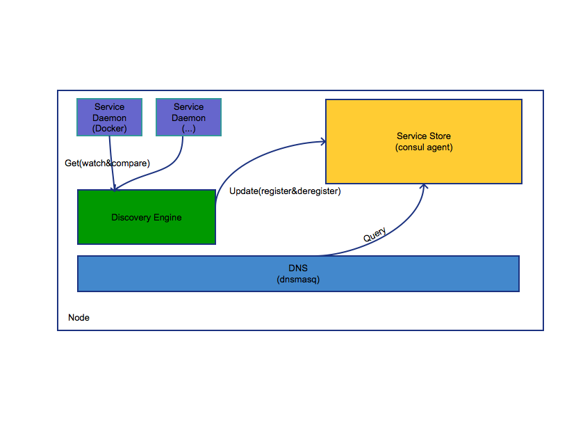

### Build

````bash
$ make
````

#### Architect



#### Example With Consul

Stps:

1. Run Consul Agent (ellipsis)
2. Run dnsmasq (ellipsis)
3. Run discovery
4. Create a container with service name ``busybox``
5. ``dig`` and verify
6. visit  ``consul`` API and verfiy


````bash

$ docker ps

CONTAINER ID        IMAGE                                                     COMMAND                  CREATED             STATUS              PORTS               NAMES
097a2b422c37        andyshinn/dnsmasq:2.75                                    "dnsmasq -k -S /consu"   3 days ago          Up 3 days                               dnsmasq
a101a61e5811        consul:0.8.4                                              "docker-entrypoint.sh"   3 days ago          Up 3 days                               consul-server-bootstrap

$ docker run -dit --name discovery \
	--restart=always --net=host \
	-e DOCKER_HOST=tcp://127.0.0.1:2376 \
	-e DOCKER_CERT_PATH=/etc/docker \
	-e DOCKER_API_VERSION=1.23 \
	-v /etc/docker/:/etc/docker/:ro \
	answer1991/discovery:1.0.0--20170626

$ docker ps
CONTAINER ID        IMAGE                                                     COMMAND                  CREATED             STATUS              PORTS               NAMES
8eef33c1474f        answer1991/discovery:1.0.0--20170626                      "./discovery serve"      44 minutes ago      Up 44 minutes                           discovery
097a2b422c37        andyshinn/dnsmasq:2.75                                    "dnsmasq -k -S /consu"   3 days ago          Up 3 days                               dnsmasq
a101a61e5811        consul:0.8.4                                              "docker-entrypoint.sh"   3 days ago          Up 3 days                               consul-server-bootstrap

$ docker run -dit \
	-l io.answer1991.service.name=busybox \
	-l io.answer1991.service.tags=primary,test \
	busybox
	
$ docker ps
CONTAINER ID        IMAGE                                                     COMMAND                  CREATED             STATUS              PORTS               NAMES
d0c858d2e863        busybox                                                   "sh"                     43 minutes ago      Up 43 minutes                           elegant_jepsen
8eef33c1474f        anwer1991/discovery:1.0.0--20170626                       "./discovery serve"      46 minutes ago      Up 46 minutes                           discovery
097a2b422c37        andyshinn/dnsmasq:2.75                                    "dnsmasq -k -S /consu"   3 days ago          Up 3 days                               dnsmasq
a101a61e5811        consul:0.8.4                                              "docker-entrypoint.sh"   3 days ago          Up 3 days                               consul-server-bootstrap

$ dig busybox.service.consul

; <<>> DiG 9.9.4-RedHat-9.9.4-29.1.alios7 <<>> busybox.service.consul
;; global options: +cmd
;; Got answer:
;; ->>HEADER<<- opcode: QUERY, status: NOERROR, id: 31557
;; flags: qr aa rd ra; QUERY: 1, ANSWER: 1, AUTHORITY: 0, ADDITIONAL: 0

;; QUESTION SECTION:
;busybox.service.consul.		IN	A

;; ANSWER SECTION:
busybox.service.consul.	0	IN	A	172.17.0.3

;; Query time: 1 msec
;; SERVER: 10.244.42.35#53(10.244.42.35)
;; WHEN: Mon Jun 26 19:29:05 CST 2017
;; MSG SIZE  rcvd: 56

$ curl -s http://127.0.0.1:8500/v1/catalog/node/e010244042035.ztt|jq
{
  "Node": {
    "ID": "13bf1a3a-3dbd-8774-fed9-8be2a3c406e4",
    "Node": "e010244042035.ztt",
    "Address": "10.244.42.35",
    "Datacenter": "dc1",
    "TaggedAddresses": {
      "lan": "10.244.42.35",
      "wan": "10.244.42.35"
    },
    "Meta": {},
    "CreateIndex": 5,
    "ModifyIndex": 31549
  },
  "Services": {
    "consul": {
      "ID": "consul",
      "Service": "consul",
      "Tags": [],
      "Address": "",
      "Port": 8300,
      "EnableTagOverride": false,
      "CreateIndex": 5,
      "ModifyIndex": 31444
    },
    "d0c858d2-e863-f63a-0f4d-7c6b953f8f08": {
      "ID": "d0c858d2-e863-f63a-0f4d-7c6b953f8f08",
      "Service": "busybox",
      "Tags": [
        "primary",
        "test"
      ],
      "Address": "172.17.0.3",
      "Port": 0,
      "EnableTagOverride": false,
      "CreateIndex": 34829,
      "ModifyIndex": 34829
    }
  }
}
````